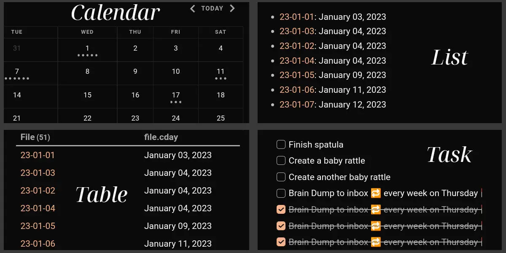

class: clear

## Petit échauffement
<br />
<br />
Votre collègue Martin Edouard vous propose une réunion mardi à 9h, pour parler de ses problèmes de veille informationnelle. Malheureusement vous êtes pris.e sur ce créneau car vous animez une formation Basecamp en interne.
<br />
<br />
<br />
.center.font150[Que lui répondez-vous ? Préparez votre mail, sans échanger avec vos voisins et voisines.]

???

Demander quels étudiants mentionnent la raison de leur indisponibilité, voire proposent à Martin de se joindre à la formation.

---
class: inverse, mline, center, middle

# Pourquoi gérer ses connaissances individuelles ?

---
class: clear

## Pourquoi gérer ses connaissances individuelles ?
<br />
<br />
* À défaut de disposer d'un outil collaboratif de partage de connaissances (ex. Basecamp)

--
* Pour aller plus loin que le papier (*un cahier ne permet pas de gérer ses connaissances*)

--
* Pour savoir toujours où collecter un nouvelle information

--
* Pour engranger et faire évoluer ses connaissances tout au long de sa vie

--
* Vous êtes des travailleurs de la connaissance (*knowledge workers*) !

???

Pourquoi pas un cahier ? Il permet simplement une prise de notes linéaire.

---
class: clear

## Définition
<br />
<br />
.center.font150[La gestion des connaissances individuelles, ou *personal knowledge management*, est le processus de collecte de l'information utile à une personne qui permet de gérer, comprendre et appliquer efficacement ces connaissances.]

???

Gérer ses idées, ses notes de réunions, ses travaux, ce qu'on lit, ce qu'on trouve inspirant...

---
class: inverse, mline, center, middle

# Comment gérer ses connaissances individuelles ?

---
class: clear

## Quels logiciels utilisez-vous pour prendre des notes, organiser vos connaissances… ?

```{r xaringanExtra-scribble, echo=FALSE}
xaringanExtra::use_scribble()
```

<br />
<br />
* .can-edit[      ]
* .can-edit[      ]
* .can-edit[      ]
* .can-edit[      ]
* .can-edit[      ]
* .can-edit[      ]

???

MS OneNote, Google Docs, Notepad, Evernote...

Quels avantages et inconvénients ?

---
class: clear

## Avec vos outils actuels de prises de note, pouvez-vous…

<br />
<br />
* retrouver facilement les notes qui portent sur un thème donné ? .can-edit[      ]
* respecter un gabarit prédéfini ? .can-edit[      ]
* mettre en forme le texte (gras, italique…) ? .can-edit[      ]
* créer un logigramme, un tableau, une formule mathématique… ? .can-edit[      ]
* identifier des liens entre les notes ? .can-edit[      ]

---
class: clear

## L'outil idéal
Des notes :
- granulaires (méthode Zettelkasten)
- reliées et formant un graphe
- possédant des métadonnées
- requêtables
<br />

--

Des métadonnées :
- personnalisables 
- cherchables 
- requêtables
<br />

--

Des informations :
- requêtables
- actionables (ex. tâche)

???

Des notions que vous avez déjà manipulées avec Cosma et Zettlr.

---
class: clear

## Exemple d'un dictionnaire

Une note par concept (avec une définition, des illustrations, exemples…), un index des pages de définitions et une page dictionnaire avec toutes les définitions.


???

Source du schéma : https://excalidraw.com/#json=EVlAduhXiqkn0SdHnhpMe,cqDNZ-38-vv5uDiRUiXwyg

---
class: clear

## Exercice


1. Combien ai-je de notes au total ?

--
2. Comment faire ça ?

--
3. Intuitivement, à quoi ressemblerait le graphe de ces notes ?

???

1. 

2. L'index fait une requête sur les métadonnées des notes, et le dictionnaire embarque les notes

3. L'index et le dictionnaire sont deux noeuds qui renvoient chacun vers les trois notes, et qui ne sont pas liés entre eux.


---
class: clear

## Obsidian
<br />
<br />
Créée en 2020, **Obsidian** est un logiciel de gestion des connaissances individuelles *propriétaire* basé sur des *fichiers Markdown* (donc réversible).

Obsidian est disponible pour Mac, Windows, Linux, iOS et Android.

Obsidian est utilisé par une communauté très active qui développe de nombreux thèmes et extensions. Et revendique 1M d'utilisateurs^[[Source](https://www.fastcompany.com/90960653/why-people-are-obsessed-with-obsidian-the-indie-darling-of-notetaking-apps)] !

Vous pouvez retrouver Obsidian, Zettlr, Notion… dans ce tableau : https://github.com/oledeuff/BUT-Infonum-3/blob/main/Tableau%20des%20outils%20pour%20markdown.md 

---
class: clear

## Utiliser Obsidian en tant qu'étudiant.e

Graphe d'une année d'étude de Master soit 3 000 notes Obsidian :


???

Source : https://preview.redd.it/chwzep72n9ib1.png?width=960&crop=smart&auto=webp&s=ba09a5fe63af011c9cd9dd19527d5e83a48e734c 
---
class: clear

## Utiliser Obsidian en tant que professionnel.le

Graphe de 6 mois de travail soit 530 notes Obsidian :
<br />
<br />


---
class: clear

## On s'y met ? À la découverte d'Obsidian !

1. Télécharger et installer Obsidian : https://obsidian.md/download

--
1. Créer un nouveau coffre dans un dossier de votre ordinateur

--
1. Créer trois dossiers dans Obsidian :
  * Notes
  * Modèles
  * Images

---
class: clear

## Organisation des notes

--
1. Créer quatre notes dans le dossier Notes :
  * Obsidian
  * Basecamp
  * Numérique collaboratif et organisation du travail
  * UE Pratiques collaboratives et partage de connaissances
<br />
--
<br />
1. Compléter la note "Numérique collaboratif et organisation du travail" en synthétisant la publication de Suzy Canivenc et Marie-Laure Cahier (2023), *Numérique collaboratif et organisation du travail. Au-delà des promesses*, Paris, Presses des Mines, https://www.la-fabrique.fr/wp-content/uploads/2023/08/n46_numerique-collaboratif-et-organisation-du-travail_web.pdf  (pp. 41-47)
<br />

.inverse[La syntaxe markdown] est un langage de balisage léger ! Voir le tuto préparé par Olivier : https://github.com/oledeuff/BUT-Infonum-3/blob/main/Tutoriel%20Markdown.md

???

L'objectif d'un langage de balisage léger est de faciliter la création de documents lisibles par les humains et également analysables par les machines ; il est utilisé pour les cas où un langage de balisage complet comme le XML ou HTML serait trop complexe

---
class: clear

## Utilisation des modèles (*templates*)


---
class: clear

## Qu'est-ce que Dataview ?

Dataview est un plugin pour Obsidian qui permet d'afficher les informations contenues dans ses notes grâce à des requêtes (il n'est pas possible de les éditer).



???

Source : https://obsidian.rocks/dataview-in-obsidian-a-beginners-guide/

---
class: clear

## Types de données que l'on peut requêter 

Les requêtes Dataview peuvent porter sur :
* les propriétés (en-tête YAML)
* les tâches 
* les items en listes
* le chemin et le nom des notes
* les liens entrants (*inlinks*) et liens sortants (*outlinks*)
* la taille des notes (en octets)
* les dates de création et de modification des notes
* les champs en ligne

--
<br />
Un **champ en ligne** permet d'insérer une information requêtable directement dans le corps de la note. Elle est utile quand cette information ne concerne pas la note dans son ensemble (contrairement à la propriété de l'en-tête).

Syntaxe : <code>Propriété:: Valeur</code>

Pour cacher cette syntaxe il faut écrire <code>Rendre les clés à (Qui:: Isabelle)</code> qui s'affichera <code>Rendre les clés à Isabelle</code>.


---
class: clear 

## Votre première requête en *Dataview Query Language*

````
```dataview
LIST 
\```
````

crée un index de toutes vos notes Obsidian. 

<br /><br />
On peut choisir de se limiter à un dossier ou à un tag :

.pull-left[````
```dataview
LIST
FROM "Notes"
\```
````]

.pull-right[````
```dataview
LIST
FROM #tag
\```
````]

<br /><br />
On peut choisir de filtrer sur un champ :

.pull-left[````
```dataview
LIST
WHERE Qui = "Isabelle"
\```
````]

.pull-right[````
```dataview
LIST
WHERE file.tags = "logiciel"
\```
````]

---
class: clear

## Exercice 

* combiner les sources : 
````
```dataview
LIST
FROM "Notes" AND (#projet/actif OR #projet/terminé) 
\```
````
